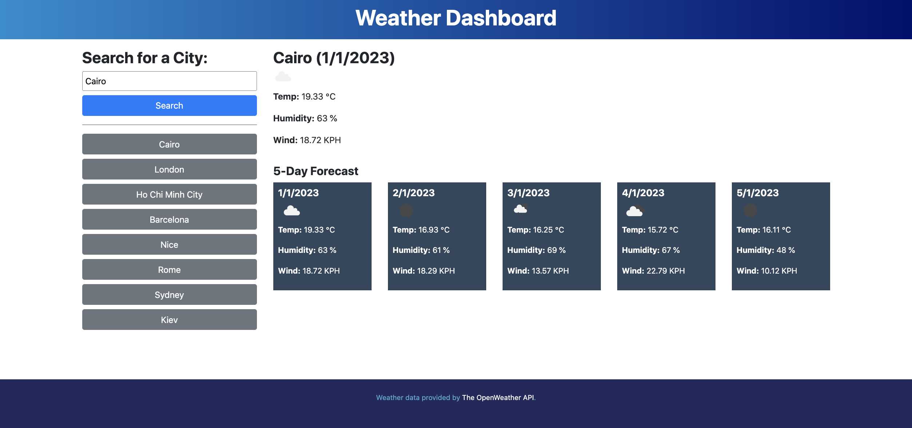

# Weather-Dashboard
Web app providing five day weather forecasts for given cities.

Weather data is sourced from the Open Weather API via jQuery AJAX calls. If the user permits access to their location data, the geolocation API is used to load weather data for the current location on page load. Otherwise, the default city of London is used.

In order to load weather data for other cities, the user can enter the name of a city in the search field. Successful search terms are stored locally in the browser and are presented as a set of history buttons below the search field. This allows the user to easily inspect the latest forecast data for previously-viewed locations. Only searched-for cities are added to the history data, so data loads initiated via the geolocation API are not included.

The weather icons provided by the Open Weather API are displayed alongside the forecast data to give the user an immediate overview of the prevailing conditions for each day.

The project has been [deployed on GitHub Pages](https://paulashby.github.io/work-day-scheduler).

## Installation

If for any reason you would like to deploy the website yourself, simply fork this repository, go to the Settings page of your fork on GitHub, select <kbd>Pages</kbd> and set the <kbd>Branch</kbd> dropdown to <kbd>main</kbd>.

## Usage

Visit [the deployed page](https://paulashby.github.io/work-day-scheduler). If you have granted browser access to your location data, a five day forecast will be loaded for your current region. Else a forecast for London will be loaded as detailed above. Use the search bar to load forecast data for a city of your choice and if available, a five day forecast for this city will be loaded and the location added to your history.

## Credits
Thanks to [the Trilogy Skills Bootcamp in Front-End Web Development](https://skillsforlife.edx.org/coding/frontend/landing/?s=Google-Unbranded&pkw=web%20design%20training&pcrid=624628533241&pmt=p&utm_source=google&utm_medium=cpc&utm_campaign=GGL%7CSKILLS-FOR-LIFE%7CSEM%7CCODING%7C-%7COFL%7CTIER-1%7CALL%7CNBD-G%7CBMM%7CPrimary%7CSubject-Matter&utm_term=web%20design%20training&s=google&k=web%20design%20training&utm_adgroupid=140443158663&utm_locationphysicalms=1006886&utm_matchtype=p&utm_network=g&utm_device=c&utm_content=624628533241&utm_placement=&gclid=Cj0KCQjwqc6aBhC4ARIsAN06NmMdwBRSe3BLeaChkukN5Bbqb18220k1ku9TB2o9tzsX0xYUc-dlRWgaAuyvEALw_wcB&gclsrc=aw.ds) for dreaming up the exercise. Thanks also to Philip Howley, the course Instructor and Brooke Love, my personal teaching assistant.

